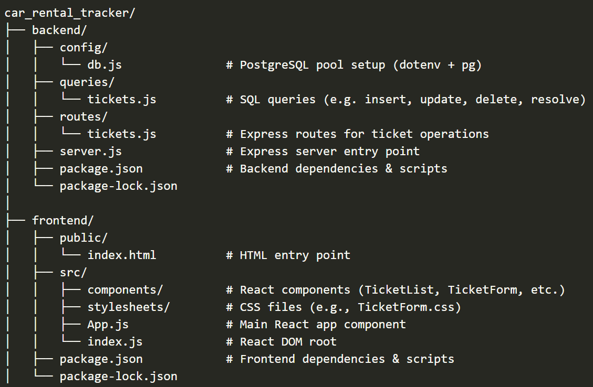

🚗 Car Rental Tracker

A full-stack issue tracking application built to streamline internal operations for a car rental company. I designed and developed this project from the ground up with a strong focus on backend architecture, clean API routing, and dynamic frontend interactivity using React.

🔨 Tech Stack

- Frontend: JavaScript, React.js, JSX, CSS

- Backend: Node.js, Express.js, PostgreSQL

- Database: PostgreSQL

- Deployment: Heroku

- Tools: dotenv, nodemon, Fetch API, Postman

📁 Project File Structure

